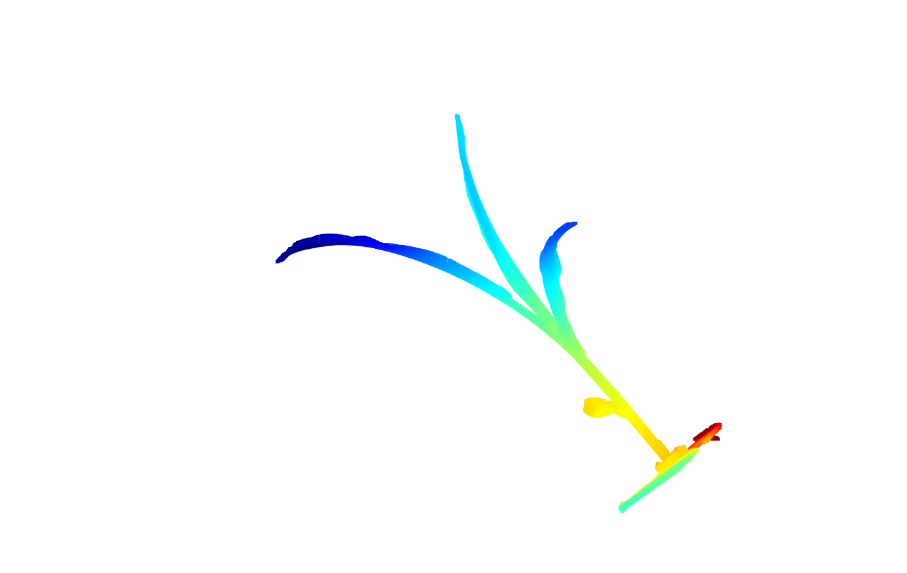

# ICP Registration


ICP registration is the process to align two point clouds `pcd1` and `pcd2`, by calculating rotation and translation

1. **Compute Centroids**: Calculate the centroids of both point clouds.
   
2. **Center the Point Clouds**: Subtract the centroids from the points in each cloud to center them around the origin.
   
3. **Compute Covariance Matrix**: Calculate the covariance matrix `H` that captures the correlation between the centered point clouds.
   
4. **Perform SVD**: Decompose the covariance matrix using Singular Value Decomposition (SVD) to extract the rotation matrix `R`.
   
5. **Compute Translation**: Compute the translation vector `t` to align the centroids after rotation.
   
6. **Form the Transformation Matrix**: Construct the final transformation matrix that combines rotation and translation.
   
7. **Apply Transformation**: Apply the computed transformation to `pcd2` to align it with `pcd1`.


### Cross verification if the ICP id correctly implemented

1. Check rotation is correct by checking determinant, R determinant: 1

2. Translation Vector t : The values has to be close to `0`, for perfect alignment
```
Translation Vector t: -1.50067e-11  -2.1771e-11 -3.05818e-11
```
3. Also check for the size of each computation to cross verify in every step.

4. Check  SVD is performed misplacing U, V will effect the whole process


## Conclusion

The ICP algorithm aligns two point clouds by computing the rotation and translation.
 
